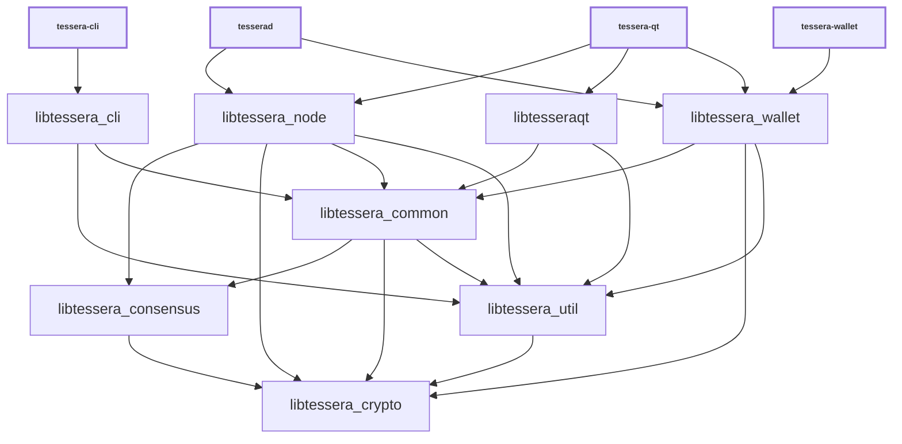

# Libraries

| Name                     | Description |
|--------------------------|-------------|
| *libtessera_cli*         | RPC client functionality used by *tessera-cli* executable |
| *libtessera_common*      | Home for common functionality shared by different executables and libraries. Similar to *libtessera_util*, but higher-level (see [Dependencies](#dependencies)). |
| *libtessera_consensus*   | Consensus functionality used by *libtessera_node* and *libtessera_wallet*. |
| *libtessera_crypto*      | Hardware-optimized functions for data encryption, hashing, message authentication, and key derivation. |
| *libtesseraqt*           | GUI functionality used by *tessera-qt* and *tessera-gui* executables. |
| *libtessera_ipc*         | IPC functionality used by *tessera-node* and *tessera-gui* executables to communicate when [`-DENABLE_IPC=ON`](multiprocess.md) is used. |
| *libtessera_node*        | P2P, RPC and validation functionality used by *tesserad* and *tessera-qt* executables. |
| *libtessera_util*        | Home for common functionality shared by different executables and libraries. Similar to *libtessera_common*, but lower-level (see [Dependencies](#dependencies)). |
| *libtessera_wallet*      | Wallet functionality used by *tesserad* and *tessera-wallet* executables. |
| *libtessera_zmq*         | [ZeroMQ](../zmq.md) functionality used by *tesserad* and *tessera-qt* executables. |

(Unlike Bitcoin Core, Tessera has no separate `libtessera_kernel` — validation
lives in *libtessera_node* — and no `libtessera_wallet_tool`; the wallet tool
code is part of the *tessera-wallet* executable.)

## Conventions

- Most libraries are internal libraries and have APIs which are completely unstable! There are few or no restrictions on backwards compatibility or rules about external dependencies.

- Generally each library should have a corresponding source directory and namespace. Source code organization is a work in progress, so it is true that some namespaces are applied inconsistently, and if you look at [`add_library(tessera_* ...)`](../../src/CMakeLists.txt) lists you can see that many libraries pull in files from outside their source directory. But when working with libraries, it is good to follow a consistent pattern like:

  - *libtessera_node* code lives in `src/node/` in the `node::` namespace
  - *libtessera_wallet* code lives in `src/wallet/` in the `wallet::` namespace
  - *libtessera_ipc* code lives in `src/ipc/` in the `ipc::` namespace
  - *libtessera_util* code lives in `src/util/` in the `util::` namespace
  - *libtessera_consensus* code lives in `src/consensus/` in the `Consensus::` namespace

## Dependencies

- Libraries should minimize what other libraries they depend on, and only reference symbols following the arrows shown in the dependency graph below:

<table><tr><td>

</td></tr><tr><td>

**Dependency graph**. Arrows show linker symbol dependencies. *Crypto* lib depends on nothing. *Util* lib is depended on by everything.

</td></tr></table>

- The graph shows what _linker symbols_ (functions and variables) from each library other libraries can call and reference directly, but it is not a call graph. For example, there is no arrow connecting *libtessera_wallet* and *libtessera_node* libraries, because these libraries are intended to be modular and not depend on each other's internal implementation details. But wallet code is still able to call node code indirectly through the `interfaces::Chain` abstract class in [`interfaces/chain.h`](../../src/interfaces/chain.h) and node code calls wallet code through the `interfaces::ChainClient` and `interfaces::Chain::Notifications` abstract classes in the same file. In general, defining abstract classes in [`src/interfaces/`](../../src/interfaces/) can be a convenient way of avoiding unwanted direct dependencies or circular dependencies between libraries.

- *libtessera_crypto* should be a standalone dependency that any library can depend on, and it should not depend on any other libraries itself.

- *libtessera_consensus* should only depend on *libtessera_crypto*, and all other libraries besides *libtessera_crypto* should be allowed to depend on it.

- *libtessera_util* should be a standalone dependency that any library can depend on, and it should not depend on other libraries except *libtessera_crypto*. It provides basic utilities that fill in gaps in the C++ standard library and provide lightweight abstractions over platform-specific features.

- *libtessera_common* is a home for miscellaneous shared code used by different Tessera applications. It should not depend on anything other than *libtessera_util*, *libtessera_consensus*, and *libtessera_crypto*.

- GUI, node, and wallet code internal implementations should all be independent of each other, and the *libtesseraqt*, *libtessera_node*, *libtessera_wallet* libraries should never reference each other's symbols. They should only call each other through [`src/interfaces/`](../../src/interfaces/) abstract interfaces.
